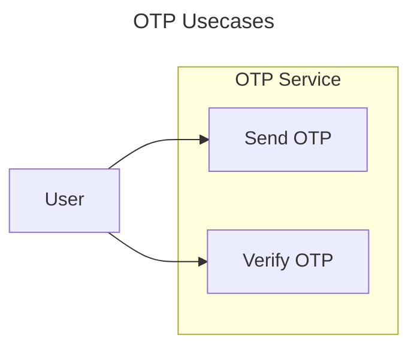

# OTP Service

The OTP Service is responsible for sending and verifying user OTP.

## Usecases





## Flows


### Flow: Send OTP


The OTP Service sends an OTP to the phone number. The OTP must then be verified using the [Flow: Verify OTP](#flow-verify-otp)


**Actors:**
- Client
	- Web
- System
	- OTP Service
	- SMS Provider

**Basic flow:**

1. Client sends OTP request to the System
2. System validates the request
	- [Rule: Phone Number](#rule-phone-number)
3. System checks if the phone number is rate-limited
4. System increments the request count
	- [Rule: Rate-Limit Policy](#rule-rate-limit-policy)
5. System updates rate-limit duration
6. System generates new OTP
	- [Rule: OTP Code](#rule-otp-code)
7. System stores the OTP for verification flow
	- [Flow: Verify OTP](#flow-verify-otp)
8. Systems calls SMS Provider to send the OTP to the client

**Alternative flow:**

- A2. Phone number invalid - return error message.
- A3. Rate limited - return error message.
- A7. Previous key-value exists - overwrite key-value.
- A8. SMS Provider fails to send SMS - tell Client to try again.

---

## Business Rules

### Rule: Phone Number

Phone number must be in E164 format. Return `ErrInvalidPhoneNumberFormat` if the format is not E164.

### Rule: Rate-Limit Policy

The Client is rate-limited based on the number of request they make for the specific phone number and reason.

The rate-limit duration is as follow:

```lua
if count > 10 then
	return 24h
else if count > 5 then
	return 1h
else if count > 3
	return 10m
else
	return 1m
end
```

### Rule: OTP Code

OTP must be at least a 4-digit number. Some ways to generate includes TOTP, HOTP.

```diff
# Bad
- abcdef
- 0
- 01

# Good
+ 542380
```
