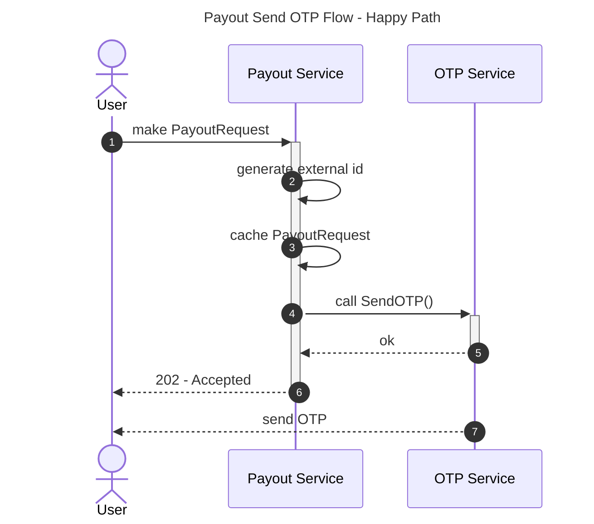
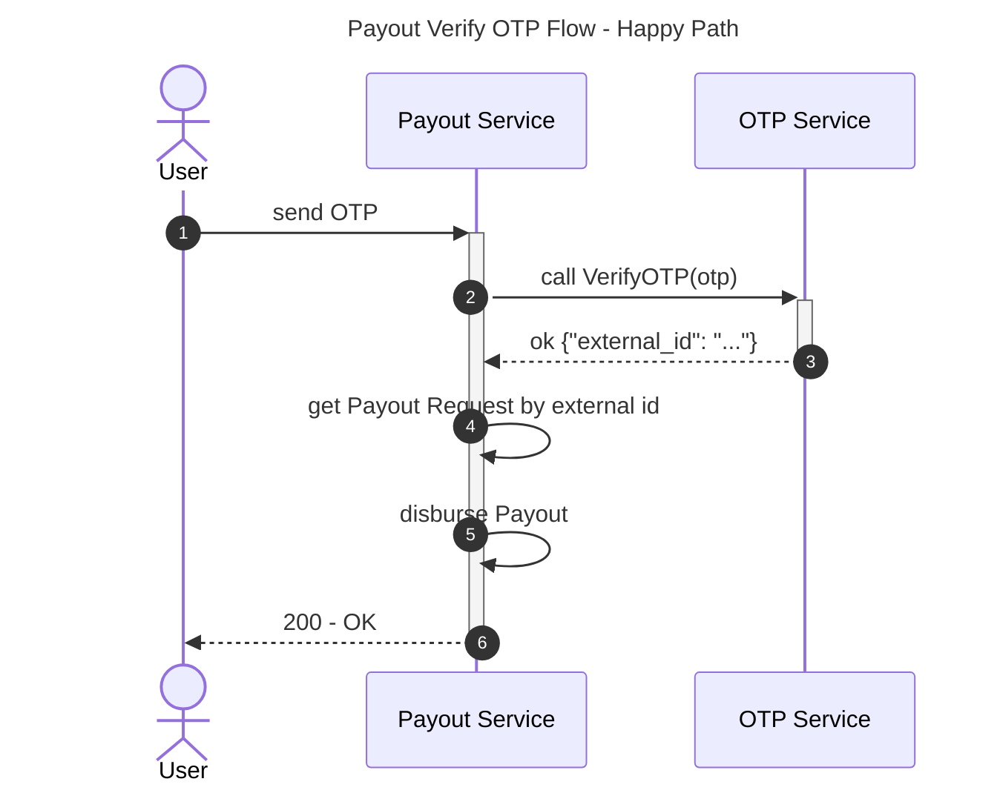
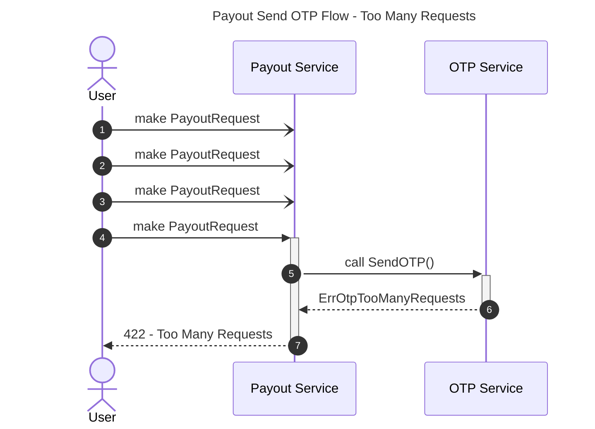
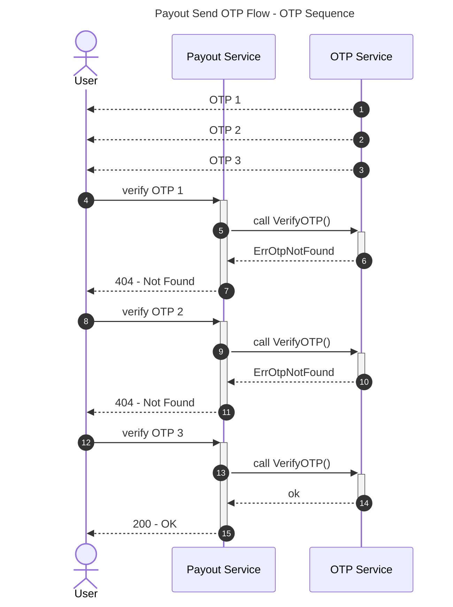
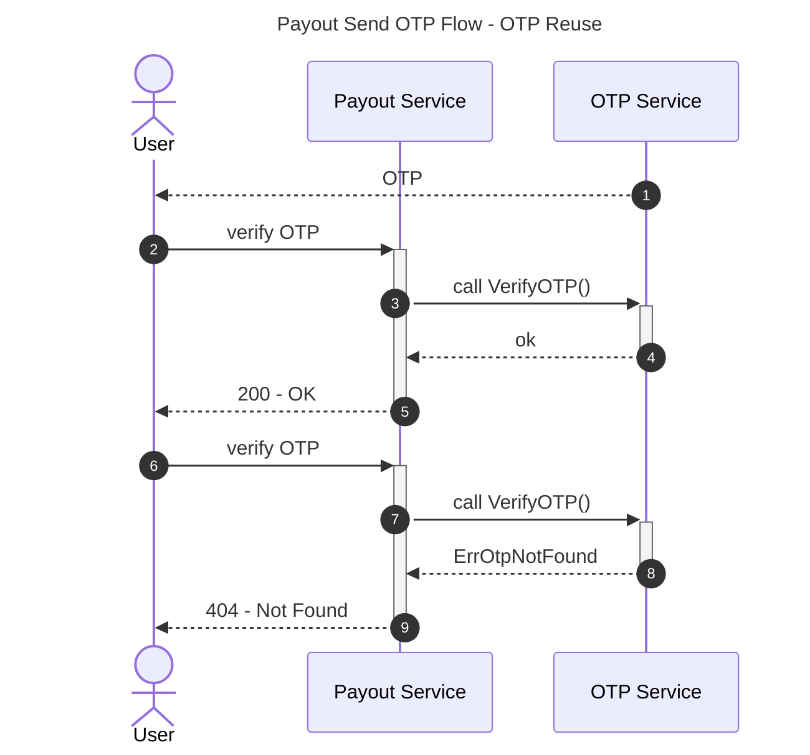

# OTP Service

The OTP Service is a Usecase-as-a-Service for sending and verifying user OTP.


## How to Use

1. Implement the `cache` interface.
2. Implement the `smsProvider` interface.
3. Init the service with the config and the dependencies.

See [./service_test.go](./service_test.go) for usage.

## Usecases

The example usecase below is sending out OTP when requesting Payout.

```markdown
As a User,
I want to request Payout,
In order to withdraw money from my Wallet to my Bank Account
```

### Scenario: Happy Path

Consists of two main flow
1. request OTP
2. verify OTP


```markdown
Given that the User request Payout from the System,
When the request is valid,
Then the System will send an OTP to the User.
```



```markdown
Given that the User submits an OTP for Payout,
When the OTP is valid,
Then the Payout will be disbursed.
```



### Scenario: Too Many Requests

To avoid DDOS, the service should be rate-limited. Below, user makes multiple requests, and will eventually be rate-limited.

```markdown
Given that the User requests multiple OTPs,
When the send threshold is exceeded,
Then the next request will result in error Too Many Requests.
```



### Scenario: OTP Sequence

```markdown
Given that the User requests multiple OTPs,
When submitting OTP for verification,
Then only the last OTP will be valid.
```



### Scenario: OTP Reuse

```markdown
Given that User successfully verified the OTP,
When the User submits the same OTP again,
Then the System should return error.
```



## System Flow

System flow describes the internal service interaction. Usecase flows only covers the interaction between the participants and the actor.


### Flow: Send OTP


The OTP Service sends an OTP to the phone number. The OTP must then be verified using the [Flow: Verify OTP](#flow-verify-otp)


**Actors:**
- Client
	- User: requests OTP
- System
	- OTP Service: sends OTP
	- SMS Provider: sends OTP through phone or Whatsapp
	- Cache: caches OTP, rate-limit key

**Basic flow:**

1. Client requests OTP from the System
2. System validates the [Phone Number](#value-object-phone-number) and [External ID](#value-object-external-id)
	- [Rule: Phone Number](#rule-phone-number)
3. System checks the Cache if the phone number is rate-limited
4. System increments the request count in Cache
	- [Rule: Rate-Limit Policy](#rule-rate-limit-policy)
5. System updates rate-limit duration in Cache
6. System generates new [OTP](#value-object-otp)
	- [Rule: OTP Code](#rule-otp-code)
7. System stores the OTP and External ID in Cache for verification flow
	- [Flow: Verify OTP](#flow-verify-otp)
8. Systems calls SMS Provider to send the OTP to the client

**Alternative flow:**

- A2. Phone number invalid - return validation error message.
- A3. Rate limited - return error message.
- A7. Previous key-value exists - overwrite key-value.
- A8. SMS Provider fails to send SMS - tell Client to try again.

---

### Flow: Verify OTP

The Verify OTP flow is responsible for verifying the generated OTP. OTP should be ephemeral - once it has been verified, the same OTP cannot be reused.

This endpoint should also be rate-limited, to avoid DDOS attack. Some rate-limit strategy includes rate-limiting by phone and client IP as well. The endpoint should ideally require authorization (user must be logged in) too.

**Actors:**
- Client
	- User: receives OTP from the [Flow: Send OTP](#flow-send-otp)
- System
	- OTP Service: validate the OTP
	- Cache: caches the OTP and rate-limit


**Basic flow:**

1. Client submits the OTP
2. System validates the request
3. System checks if the OTP exists in Cache
4. System deletes the OTP from Cache
	- [Rule: OTP should not be reused](#rule-otp-should-not-be-reused)
5. System deletes the rate-limit from Cache
6. System returns the External ID

**Alternative flow:**

- A2. Validation errors - return validation error message
- A3. OTP not found - return `ErrOtpNotFound`


## Domain

Domain includes entities and value objects. The difference between _domain_ and _business rules_ is that _domain_ is usually general, while _business rules_ is specific. Some examples below:

| Domain                            | Business Rule                                               |
| --                                | --                                                          |
| Phone Number: format must be E164 | Supported country code is only for Malaysia and Singapore   |
| OTP: must be at least 4 digits    | Use 6 digits for Payout OTP, use 4 digits for Auth OTP      |


### Value Object: Phone Number

Phone number must be in E164 format.

### Value Object: External ID

The **External ID** provided to guard against concurrent requests. A user can request OTP multiple times, and each OTP must be tied to that particular request. If the user requested the OTP 3 times, the first 2 OTP that they received should be deemed invalid.


Why is this important? Because not all requests are deemed equal. For example:

```markdown
1. User request first OTP for withdrawing MYR 1000
2. First OTP arrived, but wasn't used
3. User request second OTP for withdrawing MYR 900
4. Second OTP arrived
5. User used first OTP
6. Successfully withdrawn MYR 900 (ideal scenario: the first OTP should be invalid)
```


The External ID provided should point to the immutable request, e.g. the MD5 hash of the request of just a cache key that points to the request. That way, if the [Flow: Verify OTP](#flow-verify-otp) is successful, the `External ID` returned can be used to check if the request has been tampered.

See also [Scenario: OTP Sequence](#scenario-otp-sequence).

### Value Object: OTP

OTP must be string digits, since an OTP can start with 0.

## Business Rules

### Rule: Phone Number

- If format is invalid, return `ErrInvalidPhoneNumberFormat`
- Supported country code: Malaysia (`+60`) and Singapore (`+65`)


### Rule: Rate-Limit Policy

The Client is rate-limited based on the number of request they make for the specific phone number and reason.

The rate-limit duration is as follow:

```lua
if count > 10 then
	return 24h
else if count > 5 then
	return 1h
else if count > 3
	return 10m
else
	return 1m
end
```

### Rule: OTP Code

OTP must be at least a 4-digit number. Some ways to generate includes TOTP, HOTP.

```diff
# Bad
- abcdef
- 0
- 01

# Good
+ 542380
```

### Rule: OTP Should Not Be Reused

Once the OTP is verified, the OTP should be deleted and not reused.
